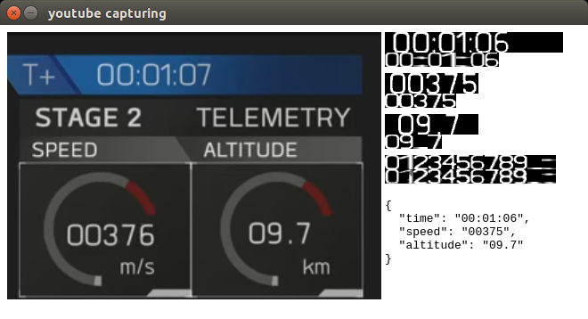
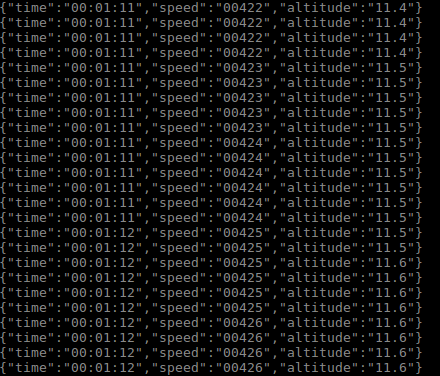

#SpaceX telemetry capturing

An attempt to capture telemetry in realtime from a live video stream

- uses electron js to be able to do desktop capturing
- uses a very crude image overlap calculation to recognize characters

It is not much yet, but it does give some results:

## getting it to run

- clone from github
- `npm install`
- `npm start`

## workings

- play the spacex video in a frame, with a bit of transforms to get the interesting part up close
- use electron to capture the window and feed it back into a video element
- capture that video element to a few canvas elements, slicing out the data bits
- some thresholding to get the individual characters in greyscale
- calculate the similarity with predefined characters and get the best
- use that to guess the character

## doing stuff with the data

The capture tries to send data over a local [mhub-server](https://github.com/poelstra/mhub). To set one up:

- (install nodejs)
- `npm install -g mhub`
- `mhub-server`

This launches an mhub server locally. If you want to see the data coming in, use

- `mhub-client -l -o jsondata`

This will give you a stream of data. With that you could

- pipe it to another utility
- listen to it with websockets
- listen to it with raw tcp sockets

### some examples

Pipe it to file:

	mhub-client -l -o jsondata > data.txt

Pipe it to mongodb:

	mhub-client -l -o jsondata | mongoimport --db spacex --collection telemetry

Listen to the bus in a website:

	ws = new WebSocket('ws://localhost:13900');

	//subscribe to receive messages
	ws.onopen = function() {
	    ws.send(JSON.stringify({
	        type: 'subscribe',
	        node: 'default'
	    }));
	};

	//handle messages received
	ws.onmessage = function(msg) {
	    console.log(JSON.parse(msg.data));
	};

Listen with nodejs:

	var MClient = require("mhub").MClient;

	var client = new MClient("ws://localhost:13900");

	//subscribe to receive messages
	client.on("open", function() {
	    client.subscribe("default");
	});

	//handle messages received
	client.on("message", function(message) {
	    console.log(message);
	});

Listen with python:

	import websocket
	import json

	#subscribe to receive messages
	def on_open(ws):
	    ws.send('{"type":"subscribe","node":"default"}')

	#handle messages received
	def on_message(ws, message):
	    print json.loads(message)

	ws = websocket.WebSocketApp("ws://localhost:13900",
	                            on_message = on_message,
	                            on_open = on_open)

	ws.run_forever()

## improvements / plans

- better character segmentation (it is currently not properly segmented when the video resolution is low)
- better character recognition, we may use a somewhat smarter algorithm, but it needs to be fast.
- more user friendly ui.